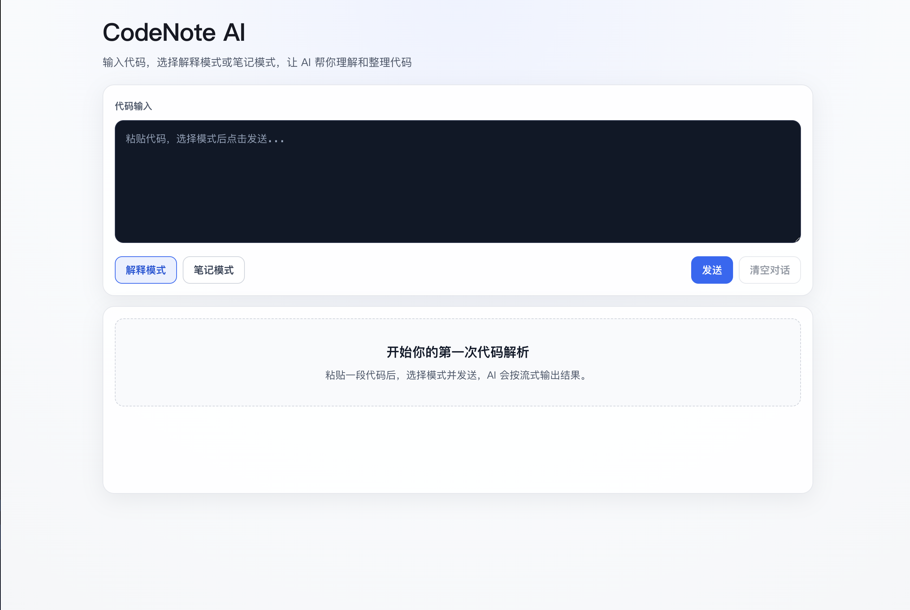
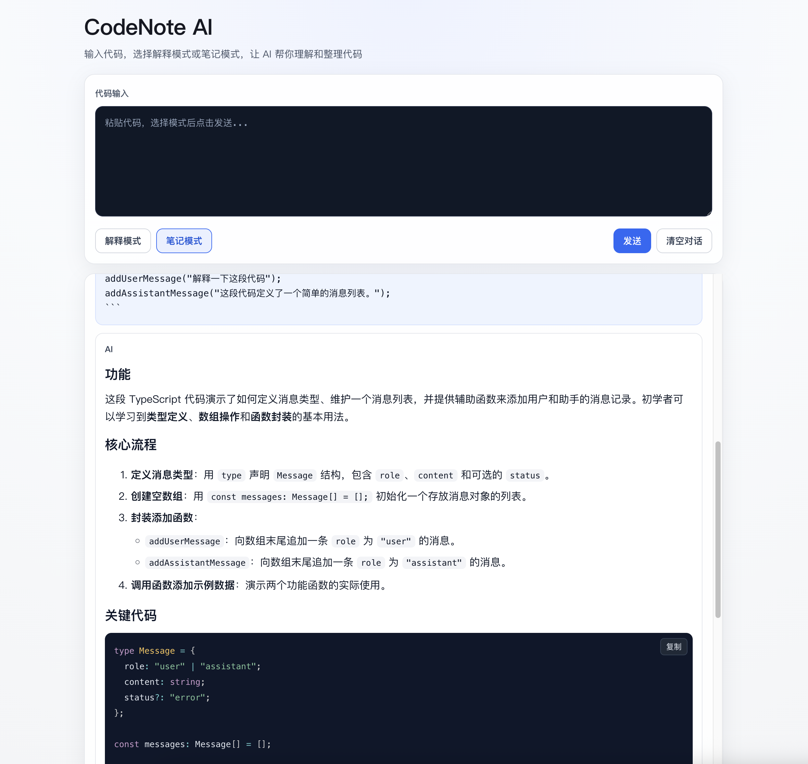
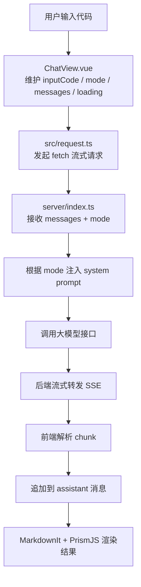

# CodeNote AI

CodeNote AI 是一个基于 Vue 3 + TypeScript + Node.js 的代码解释与笔记生成工具。用户输入代码后，可以选择解释模式或笔记模式，由后端代理调用大模型接口，并在前端以流式方式展示结果。

## 功能特性

- 解释模式：面向代码逻辑说明，输出简洁解释内容
- 笔记模式：面向结构化输出，生成 Markdown 形式的学习笔记
- 后端代理调用大模型：前端不直连模型服务，由 `server/index.ts` 统一转发
- 流式输出：后端流式转发，前端逐 chunk 渲染
- 停止生成：支持中断当前请求
- Markdown 渲染：AI 回复按 Markdown 展示
- PrismJS 代码高亮：支持 TypeScript / JavaScript / CSS / HTML 代码块高亮
- 代码块复制按钮：可一键复制代码块内容
- 自动滚动到底部：新消息生成时自动定位到最新内容
- 错误提示：请求失败、超时、中断等状态有明确提示
- 请求上下文裁剪：仅发送最近 N 条上下文（当前为 12 条）
- 清空对话：支持一键清空当前消息列表
- 空状态展示：无消息时显示引导文案

## 项目截图





## 技术栈

### 前端

- Vue 3
- TypeScript
- Vite
- MarkdownIt
- PrismJS
- Fetch Stream（`response.body.getReader()`）
- AbortController

### 后端

- Node.js
- `node:http`
- OpenAI-compatible Chat Completions API
- Server-Sent Events（SSE）流式转发
- 环境变量配置（模型密钥、模型地址、模型名称）

## 项目架构

```text
用户输入代码
  ↓
ChatView.vue 维护 inputCode / mode / messages / loading
  ↓
request.ts 发起 fetch 流式请求
  ↓
server/index.ts 接收 messages + mode
  ↓
根据 mode 注入 system prompt
  ↓
调用大模型接口
  ↓
后端流式转发
  ↓
前端逐 chunk 追加到 assistant 消息
  ↓
MarkdownIt + PrismJS 渲染 AI 回复
```



## 目录结构

```text
CodeNote-AI/
├── server/
│   └── index.ts                # Node HTTP 服务，处理 /health 与 /api/chat，代理模型并流式转发
├── src/
│   ├── views/
│   │   └── ChatView.vue        # 主页面：输入、模式切换、消息状态、流式渲染、停止生成、清空对话
│   ├── request.ts              # 前端请求层：fetch 流式读取、SSE 解析、超时与中断处理
│   ├── chat.ts                 # 类型定义：Message、ExplainMode、ChatRequestPayload 等
│   ├── style.css               # 全局基础样式（字体、背景、基线）
│   ├── App.vue                 # 根组件
│   └── main.ts                 # 应用入口
├── package.json                # 依赖与脚本（dev/build/type-check）
└── README.md
```

## 本地启动

### 1. 安装依赖

```bash
npm install
```

### 2. 配置 `.env`

在项目根目录创建 `.env`：

```bash
MODEL_API_KEY=your_api_key
MODEL_API_URL=https://api.deepseek.com/chat/completions
MODEL_NAME=deepseek-v4-flash
```

说明：

- `MODEL_API_KEY`：必填
- `MODEL_API_URL`：可选，不填时后端会使用默认值
- `MODEL_NAME`：可选，不填时后端会使用默认值

### 3. 启动后端服务

```bash
node server/index.ts
```

后端默认监听：`http://localhost:3001`

健康检查：

```bash
curl http://localhost:3001/health
```

### 4. 启动前端服务

```bash
npm run dev
```

前端会通过 `src/request.ts` 中的固定地址调用后端：

- `http://localhost:3001/api/chat`

## 核心实现说明

### 为什么使用后端代理？

前端不直接保存和调用模型密钥。模型 API Key 放在后端环境变量中，避免在浏览器端暴露敏感信息。

后端统一处理模型调用协议、参数拼接和错误映射。前端只处理业务交互和展示，不承载模型调用细节。

这种拆分也让后续扩展更简单，例如切换模型供应商、增加鉴权、增加限流或日志，都可以集中在后端处理。

### 解释模式和笔记模式如何实现？

前端在 `ChatView.vue` 维护 `mode`（`explain | note`），并把该字段随 `messages` 一起传给后端。

后端在 `server/index.ts` 根据 `mode` 选择不同的 system prompt：解释模式强调“代码逻辑与关键点”，笔记模式强调“结构化 Markdown”。

该方案把“交互选择”和“模型行为”解耦：前端负责选择模式，后端负责落地提示词策略。

### 流式输出如何实现？

后端调用上游模型接口时设置 `stream: true`，拿到流式响应后，通过 `text/event-stream` 头把数据块原样转发给前端。

前端在 `src/request.ts` 使用 `response.body.getReader()` 读取字节流，并按 SSE 事件边界解析 `data:` 内容，再抽取 `delta.content`。

`ChatView.vue` 在发送时先插入空的 assistant 消息，随后按 chunk 逐段追加，实现“边生成边显示”的打字式体验。

### 停止生成如何实现？

前端每次发送会创建 `AbortController`，并把 `signal` 传给 `streamExplainCode`。

用户点击“停止生成”后调用 `abort()`，请求层在 `catch` 分支识别中断类型并抛出“已停止生成”。

页面侧根据该状态更新最后一条 assistant 消息，避免中断后出现空白或状态不明确的问题。

### Markdown 渲染和代码高亮如何实现？

AI 回复内容以 Markdown 字符串形式保存在消息里，页面使用 MarkdownIt 将其渲染为 HTML。

代码块渲染走 MarkdownIt 的 `highlight` 钩子，调用 PrismJS 做语法高亮；当前已引入 TS / JS / CSS / HTML 语言包。

代码块复制按钮基于渲染后的 `pre` 节点动态注入，点击后读取对应 `code` 文本并写入剪贴板。

### 上下文裁剪有什么作用？

长对话场景下，如果每次都发送全部历史消息，请求体会持续增大，响应速度和成本都会受到影响。

当前在发送前使用 `slice(-MAX_CONTEXT_MESSAGES)` 只截取最近 12 条消息传给后端，降低单次请求负担。

页面仍保留完整消息历史展示，性能优化不影响用户对话可见性。

## 安全与性能考虑

- API Key 存放在后端环境变量，前端不暴露密钥
- MarkdownIt 未开启原生 HTML 渲染（默认关闭），降低 XSS 风险
- 前端使用 AbortController 支持主动中断请求
- 后端统一处理模型接口错误，并将错误状态返回给前端
- 上下文裁剪减少请求体体积和 token 压力
- 流式输出提升等待阶段的可感知速度与交互体验

## 后续优化方向

- localStorage 保存历史记录（刷新后恢复会话）
- 代码块复制按钮组件化，替代当前 DOM 注入方式
- 支持更多 OpenAI-compatible 模型供应商配置
- 增加部署地址与演示截图（当前：截图待补充）
- 增加基础测试（请求层解析、关键交互逻辑）
- 继续优化移动端交互与布局细节

## 项目亮点

CodeNote AI 不是单纯聊天框，而是完整打通了从前端交互、后端代理、大模型调用、流式输出、Markdown 渲染、代码高亮、代码复制、停止生成、错误处理到上下文裁剪的一条 AI 应用链路。当前版本已经具备完整的输入、生成、展示、中断和错误处理链路，可用于展示一个 AI 辅助代码理解工具的核心实现。
